This project presents a collection of 20 different conifer plant species, identified and organized based on their common names, scientific names, and distinctive visual characteristics. The purpose of this compilation is to provide a clear and structured reference for recognizing various evergreen plants, particularly those commonly used in landscaping and ornamental gardening. Each plant entry is supported with representative images to enhance visual identification and understanding.

| #  | Common Name            | Scientific Name                | Distinctive Visual Description                                      | Image |
|----|------------------------|--------------------------------|---------------------------------------------------------------------|-------|
| 1  | Nordmann Fir           | *Abies nordmanniana*           | Dense dark green needles with soft texture and symmetrical shape.  | 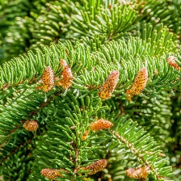 |
| 2  | Norfolk Island Pine    | *Araucaria heterophylla*       | Layered branches forming a symmetrical pyramid shape.              | 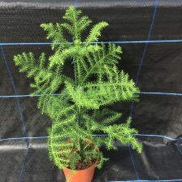 |
| 3  | Arizona Cypress        | *Cupressus arizonica*          | Blue-gray foliage with a conical form and rough bark.              | 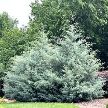 |
| 4  | White Cypress Pine     | *Callitris columellaris*       | Fine, needle-like leaves with a narrow upright growth habit.       | 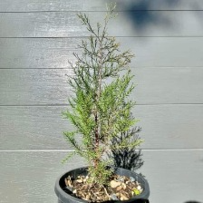 |
| 5  | Lawson Cypress         | *Chamaecyparis lawsoniana*     | Soft scale-like foliage with feathery texture and elegant form.    | 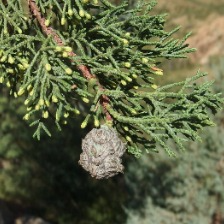 |
| 6  | Sawara Cypress         | *Chamaecyparis pisifera*       | Delicate thread-like or feathery foliage, often bright green.      |  |
| 7  | Italian Cypress (Gold) | *Cupressus sempervirens*       | Tall narrow column shape with golden-green foliage.                | 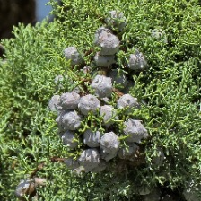 |
| 8  | Monterey Cypress       | *Cupressus macrocarpa*         | Broad spreading crown with dense dark green foliage.               | 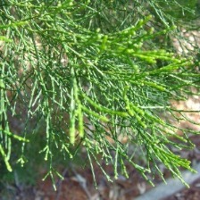 |
| 9  | Himalayan Cypress      | *Cupressus torulosa*           | Graceful drooping branches with soft green foliage.                | 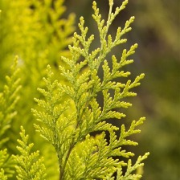 |
| 10 | Chinese Juniper        | *Juniperus chinensis*          | Dense evergreen shrub/tree with scale-like green foliage.          | 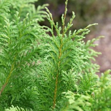 |
| 11 | Eastern Red Cedar      | *Juniperus virginiana*         | Compact conical tree with blue-green foliage and berry cones.      | 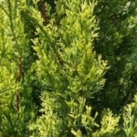 |
| 12 | Leyland Cypress        | *Cupressus × leylandii*        | Fast-growing hybrid with dense feathery foliage.                   | 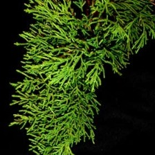 |
| 13 | Oriental Arborvitae    | *Platycladus orientalis*       | Upright branches with flattened sprays of bright green leaves.     |  |
| 14 | White Spruce           | *Picea glauca*                | Conical tree with short stiff needles and bluish-green color.      | 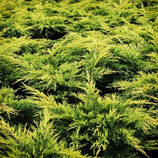 |
| 15 | Stone Pine             | *Pinus pinea*                 | Umbrella-shaped canopy with long needles and thick trunk.          | 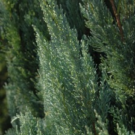 |
| 16 | Buddhist Pine          | *Podocarpus macrophyllus*     | Long narrow glossy leaves with a neat upright growth habit.        | 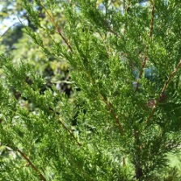 |
| 17 | Coast Redwood          | *Sequoia sempervirens*        | Very tall tree with reddish bark and soft flat needles.            | 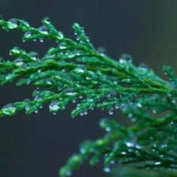 |
| 18 | Bald Cypress           | *Taxodium distichum*          | Deciduous conifer with feathery leaves and buttressed trunk base.  | 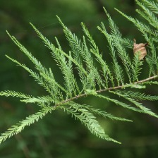 |
| 19 | English Yew            | *Taxus baccata*               | Dark green needle-like leaves with red berry-like arils.           | 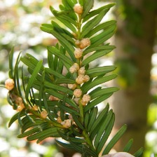 |
| 20 | American Arborvitae    | *Thuja occidentalis*          | Dense conical shrub/tree with scale-like bright green foliage.     | 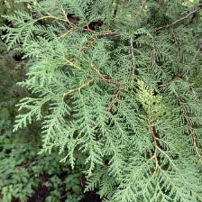 |

# Plant Species Image Classification
## Laboratory Work 2-A Activity

### A. Project Overview
This project focuses on the development of a machine learning model designed to classify 20 different variants of Ornamental Plants. 

### Purpose: 
The goal is to evaluate how effectively an Image Classification model (trained via Teachable Machine) can distinguish between closely related cultivars that share similar leaf shapes but differ in color distribution and spotting patterns.

### B. Plant Species Section

### C. Model Training Details
The model was trained using the Standard Image Model architecture.

Epochs: 110
- I selected 110 epochs to give the model sufficient training cycles to learn patterns from the dataset and enhance its accuracy. This number allows the model to update its weights multiple times while maintaining a reasonable training time. Additionally, it is commonly used as an initial value in many machine learning experiments.

Batch Size: 16

Learning Rate: 0.001

Images per Class: 250 and 250+

### Screenshot of the training settings
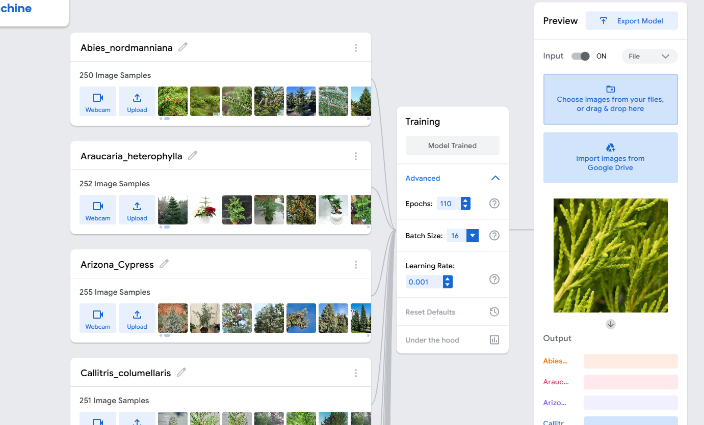

### D. Model Evaluation
The following metrics were captured from the "Under the Hood" section of Teachable Machine.

#### Confusion Matrix
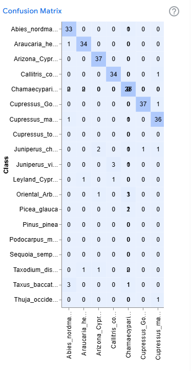

#### Accuracy per Class
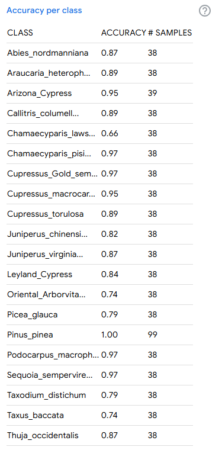

#### Accuracy per Epoch
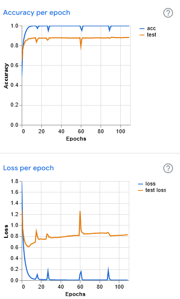

### E. Model Testing

### F. Reflection

1. How did the number of images per class affect your model’s accuracy?
Having more images in each class made the model more accurate because it had more examples to learn from. This helped the model understand each plant better.

2. Which plant species were most commonly misclassified and why?
Plants that look very similar were often misclassified. This is because the model had a hard time telling them apart when their leaves or shapes looked almost the same.

3. How did changing the epochs, batch size, or learning rate affect the training results?
More epochs helped improve accuracy, but too many made the model overfit. The learning rate affected how fast the model learned—too fast caused mistakes, and too slow made training take longer. Batch size changed how smooth and fast the training was.

4. What challenges did you encounter during dataset collection and labeling?
It was hard to find enough clear and good-quality images. Avoiding duplicate images and making sure labels were correct was also difficult. Organizing the dataset took time.

5. If you were to improve your model, what specific changes would you make and why?
I would add more images and use better-quality ones. I would also adjust the training settings and maybe use a better model to improve accuracy.
